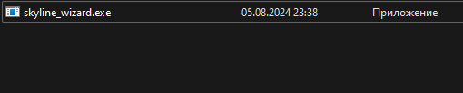

# Github Skyline (Alternative)  


Alternative of https://skyline.github.com/

> [!WARNING]  
> The official [CLI](https://github.com/github/gh-skyline) from github has been released, but the design of the models from the site and from the cli is different.
> 
> My program follows the original design.


This program generate 3d graph of your contributions to GitHub platform
___

___

<!-- TOC -->
* [Github Skyline (Alternative)](#github-skyline-alternative-)
  * [Usage](#usage)
    * [UI usage](#ui-usage)
      * [Windows](#windows)
      * [Linux and Mac](#linux-and-mac)
    * [CLI usage](#cli-usage)
      * [MacOS / Linux](#macos--linux)
      * [Windows](#windows-1)
  * [Python usage](#python-usage)
  * [Compatibility](#compatibility)
  * [Developments builds](#developments-builds)
<!-- TOC -->

## Usage

- Go to the latest release and select your platform
  
- Download your system archive
- Unzip archive

### UI usage

#### Windows



- Double-click on downloaded file


#### Linux and Mac

- Run the download binary

```shell
./skyline-wizard.bin
```


### CLI usage
(Use same file)
> [!WARNING]  
> The command line interface only works in developer builds because the antivirus considers it a virus


Example:

#### MacOS / Linux

```shell
./skyline-wizard.bin -u doctorixx -y 2024
```

#### Windows

```shell
./skyline-wizard.exe -u doctorixx -y 2024
```

## Python usage

- Clone this repo

```shell
git clone https://github.com/doctorixx/github-skyline.git
cd github-skyline
```

- Install all python requirements

```shell
pip install -r requirement.txt
```

- Change variables (in **github-stats.py**)

```python
from core import process_github_stats

if __name__ == '__main__':
    username = "doctorixx"  # CHANGE TO YOUR USERNAME
    year = "2023"  # CHANGE TO YOUR YEAR
    filename = f"{username}-{year}.stl"  # <- Generated filename

    process_github_stats(username, year, filename)
```

- run **github-stats.py**

> Linux/MacOS:
> ```shell
> python3 github-stats.py
> ```
> Windows:
> ```shell
> python github-stats.py
> ```

Check "*.stl" fies in project root


## Compatibility

(Checked binaries, With Python app works correctly on all platforms)

| OS      | x64 | arm64 |
|---------|:---:|:-----:|
| MacOS   |  ❔  |   ❔   |
| Linux   |  ✅  |   ❌   |
| Windows |  ✅  |   ❔   |

## Developments builds

You can find developments build in GitHub Actions
