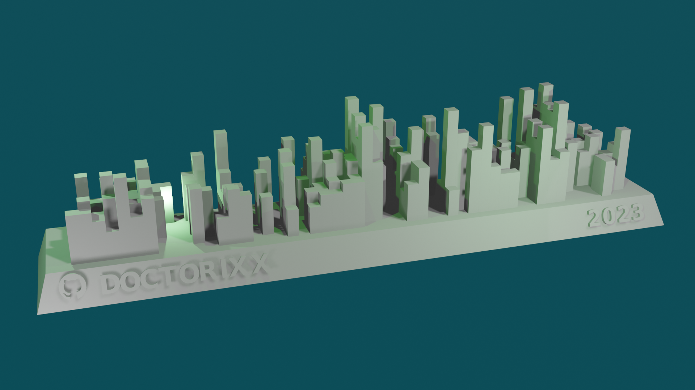
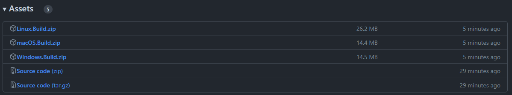
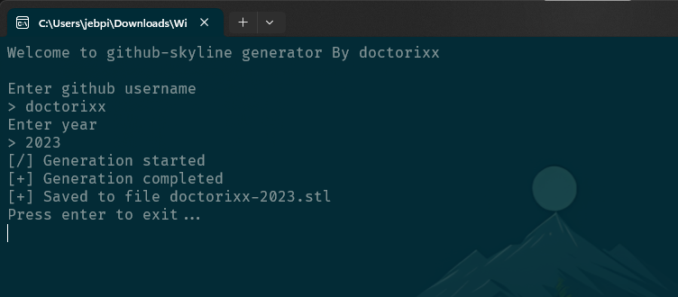
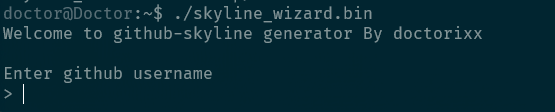
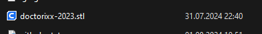
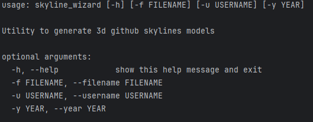

# GitHub Skyline (Alternative)


[](https://www.python.org/downloads/)
[](LICENSE)

**An alternative implementation of [GitHub Skyline](https://skyline.github.com/) that generates 3D models of your GitHub contribution history.**

Transform your GitHub contributions into stunning 3D landscapes that you can 3D print, display, or share!



---

## ✨ Features

- 🎯 **Faithful Design**: Follows the original GitHub Skyline design (unlike the official CLI)
- 🖥️ **Multiple Interfaces**: GUI, CLI, and Python library support
- 📦 **Cross-Platform**: Works on Windows, macOS, and Linux
- 🎨 **STL Export**: Ready-to-print 3D models
- 🚀 **Easy Installation**: Simple pip install or standalone binaries

## 🚀 Quick Start

### Installation

```bash
pip install github-skyline
```

### Generate Your Skyline

**GUI Mode:**
```bash
python -m github_skyline
```

**CLI Mode:**
```bash
python -m github_skyline --help
python -m github_skyline -u your-username -y 2024
```

## 📖 Detailed Usage

### Method 1: Python Package (Recommended)

1. **Install the package:**
   ```bash
   pip install github-skyline
   ```

2. **Launch GUI:**
   ```bash
   python -m github_skyline
   ```

3. **Or use CLI:**
   ```bash
   python -m github_skyline -u your-username -y 2024
   ```

### Method 2: Standalone Binaries

1. **Download:** Go to [Releases](https://github.com/doctorixx/github-skyline/releases) and download the appropriate binary for your system:

   

2. **Extract** the downloaded archive

3. **Run the application:**

   **Windows:**
   - Double-click `skyline-wizard.exe`
   
   

   **macOS/Linux:**
   ```bash
   ./skyline-wizard.bin
   ```
   
   

### Method 3: From Source

1. **Clone the repository:**
   ```bash
   git clone https://github.com/doctorixx/github-skyline.git
   cd github-skyline
   ```

2. **Install dependencies:**
   ```bash
   pip install -r requirements.txt
   ```

3. **Edit configuration** in `github-stats.py`:
   ```python
   from core import process_github_stats
   
   if __name__ == '__main__':
       username = "your-username"  # Replace with your GitHub username
       year = "2024"              # Replace with desired year
       filename = f"{username}-{year}.stl"
       process_github_stats(username, year, filename)
   ```

4. **Run the script:**
   ```bash
   python github-stats.py
   ```

5. **Find your STL file** in the project root directory:
   
   

## 🔧 CLI Options



### Available Commands

| Option | Description | Example |
|--------|-------------|---------|
| `-u, --username` | GitHub username | `-u doctorixx` |
| `-y, --year` | Year to generate | `-y 2024` |
| `-o, --output` | Output filename | `-o my-skyline.stl` |
| `-h, --help` | Show help message | `--help` |

### Examples

```bash
# Generate skyline for user 'doctorixx' for 2024
python -m github_skyline -u doctorixx -y 2024

# Custom output filename
python -m github_skyline -u doctorixx -y 2024 -o my-contributions.stl
```

## 🖥️ Platform Compatibility

| Platform | x64 | ARM64 | Status |
|----------|:---:|:-----:|:------:|
| Windows  | ✅  | ❔    | Tested |
| Linux    | ✅  | ❌    | Tested |
| macOS    | ❔  | ❔    | Untested |

**Legend:**
- ✅ Fully supported and tested
- ❔ Should work but not extensively tested
- ❌ Not supported

> **Note:** Python package works correctly on all platforms. Compatibility table refers to standalone binaries.

## ⚠️ Important Notes

> **Official CLI Differences:** While GitHub has released an [official CLI tool](https://github.com/github/gh-skyline), it uses a different design. This project maintains compatibility with the original GitHub Skyline website design.

> **Antivirus Warning:** Some antivirus software may flag standalone binaries as suspicious. This is a false positive common with PyInstaller-generated executables. The Python package installation is recommended for security-conscious users.

## 🛠️ Development

### Development Builds

Development builds are available through [GitHub Actions](https://github.com/doctorixx/github-skyline/actions).

### Contributing

1. Fork the repository
2. Create a feature branch
3. Make your changes
4. Submit a pull request

### Building from Source

```bash
# Install build dependencies
pip install -r requirements-dev.txt

# Build standalone executable
pyinstaller --onefile github-stats.py
```

## 📝 License

This project is licensed under the MIT License - see the [LICENSE](LICENSE) file for details.

## 🤝 Support

- 🐛 **Bug Reports:** [Open an issue](https://github.com/doctorixx/github-skyline/issues)
- 💡 **Feature Requests:** [Start a discussion](https://github.com/doctorixx/github-skyline/discussions)
- 📧 **Questions:** Check existing issues or start a new discussion

## 🎉 Showcase

Share your GitHub Skylines! Tag us or open a discussion to show off your 3D printed contributions.

---

**Made with ❤️ by the community | Star ⭐ this repo if you find it useful!**
